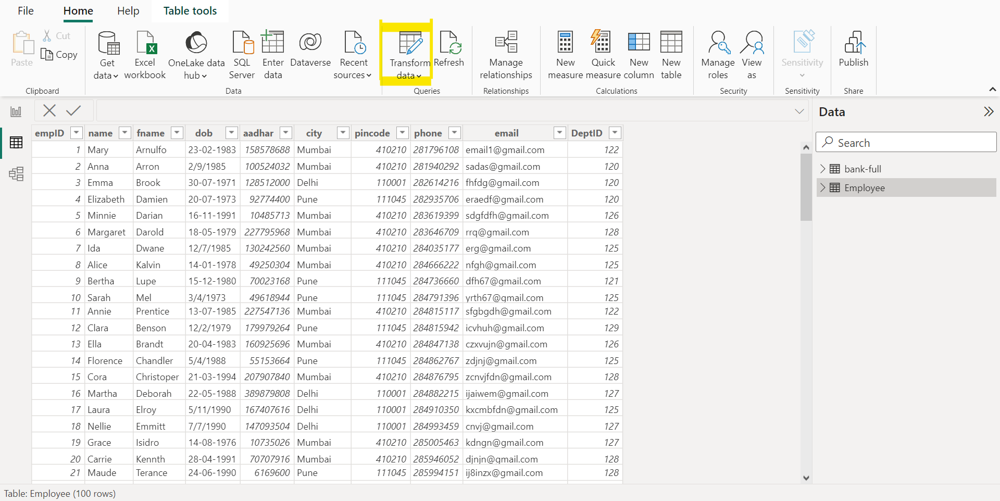
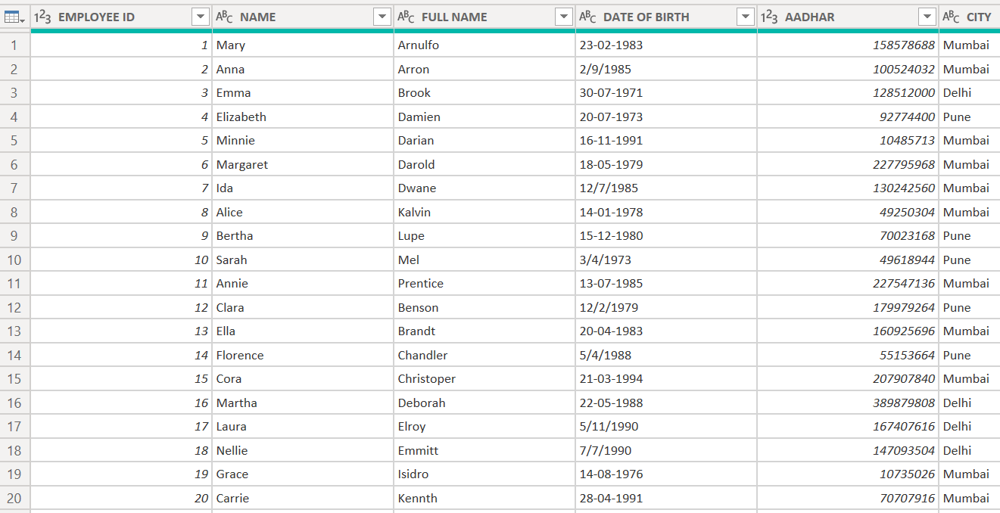

# DATA CLEANING AND TRANSFORMATION

## INTRODUCTION

The task at hand, titled "Data Cleaning and Transformation for 'Employee.csv' Dataset," involves a comprehensive and meticulous cleansing process of the 'Employee.csv' dataset. This dataset, comprising 100 rows of information, is a valuable repository of employee-related data. Data quality is paramount for any analytical or machine learning endeavor, and the effectiveness of subsequent analyses heavily depends on the cleanliness and integrity of the dataset.

In this task, we will employ Power BI as the primary tool for data cleaning. Power BI, a powerful business analytics tool by Microsoft, offers a suite of features and functionalities ideal for data preparation and transformation. Our objective is to leverage Power BI's capabilities to thoroughly clean, sanitize, and optimize the 'Employee.csv' dataset, ensuring that it meets the highest standards of accuracy, consistency, and reliability. By enhancing columns for improved readability and comprehension, standardizing formats, and adjusting data types, we aim to enhance the overall quality of the dataset, thereby laying a robust foundation for any future data-driven analyses or modeling efforts.

## PROBLEM STATEMENT

The task involves a thorough cleaning process for the 'Employee.csv' dataset, encompassing the following steps:
1. Renaming columns and converting column names to uppercase
   
2. Standardizing formats and adjusting data types

The objective is to enhance data consistency, readability, and uniformity within the dataset, ensuring it aligns with best practices for subsequent analyses and modeling.

## SKILLS AND CONCEPTS DEMONSTRATED

In the task of extensively cleaning the 'Employee.csv' dataset, several skills and concepts need to be demonstrated. These include:

1. Data Transformation:
   - Skill in transforming data, including renaming columns, converting text to uppercase, standardizing formats, and adjusting data types
2. Data Quality Assessment:
   - Understanding and assessing data quality issues and implementing solutions to ensure accuracy, completeness, and consistency
3. Tool Proficiency:
   - Demonstrating proficiency in Power BI to perform the necessary data transformations
4. Communication Skills:
   - Clearly documenting the steps taken in the cleaning process, any assumptions made, and the rationale behind the chosen transformations.

By successfully executing these skills and concepts, the task aims to produce a refined and standardized 'Employee.csv' dataset that is ready for further analysis or modeling.

## DATA CLEANING STEPS, DISCUSSIONS AND RESULTS

### 1. Renaming Columns and Converting Column Names to Uppercase:

Data cleaning and transformation within POWER BI is accomplished through the Power Query Editor, a robust tool for shaping, cleaning, and refining data before integrating it into Power BI Desktop. Users have the flexibility to either transform the data in Power Query Editor before loading it or load the dataset into Power BI Desktop and then proceed to Power Query Editor. For this task, we'll begin by importing the employee dataset into Power BI Desktop, following the steps outlined in "Power BI Task 1: Data Integration."

Once the employee dataset is imported into Power BI Desktop, it appears in the data pane on the right side of the Power BI environment. To visualize and work on the dataset, click on the table view icon located on the left side of the Power BI environment. Upon inspection, the columns are identified as inconsistent, prompting the need for refinement.

To initiate transformations in the Power Query Editor, click on the transform icon in the Power BI ribbon. This action navigates to the Power Query Editor, where we proceed to change column names and convert them to uppercase for enhanced visibility. For instance, the 'empID' column becomes 'EMPLOYEE ID,' 'fname' transforms to 'FULL NAME,' 'dob' is updated to 'DATE OF BIRTH,' and so forth.

As the Power Query Editor provides a limited view of the dataset, capturing the entire dataset requires navigating forward and backward, therefore just some aspect of the dataset would be captured to showcase the transformation of changed columns emphasizing the substantial difference between the original and refined columns.

PREVIOUS COLUMNS            | RENAMED AND UPPERCASE COLUMNS
:--------------------------:|:-----------------------------:
              |      

    
   

