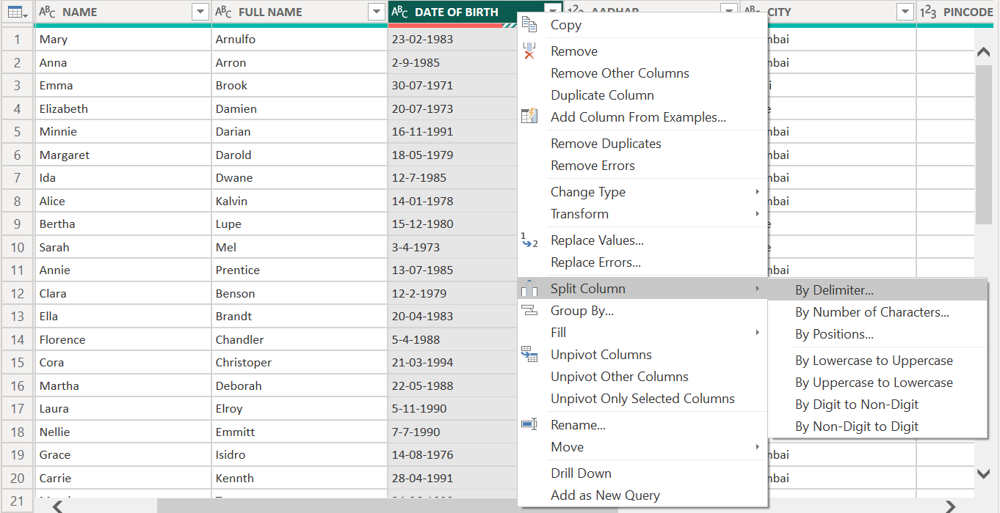
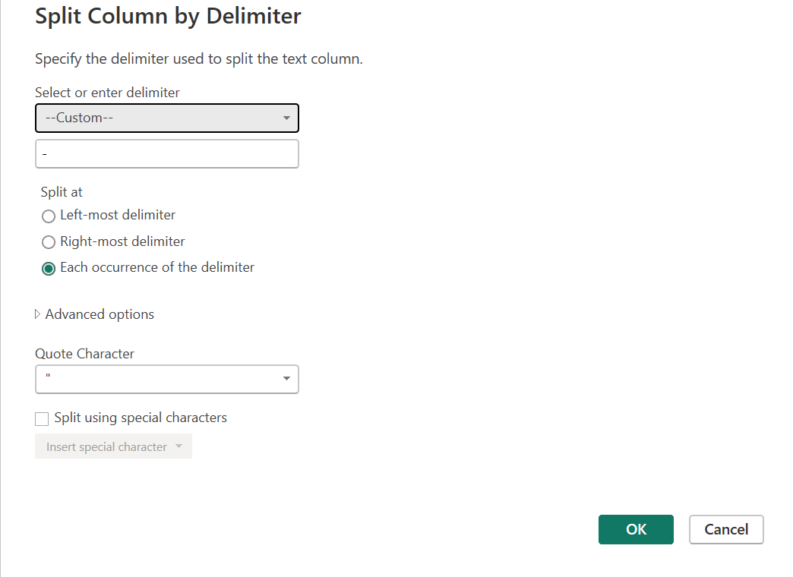
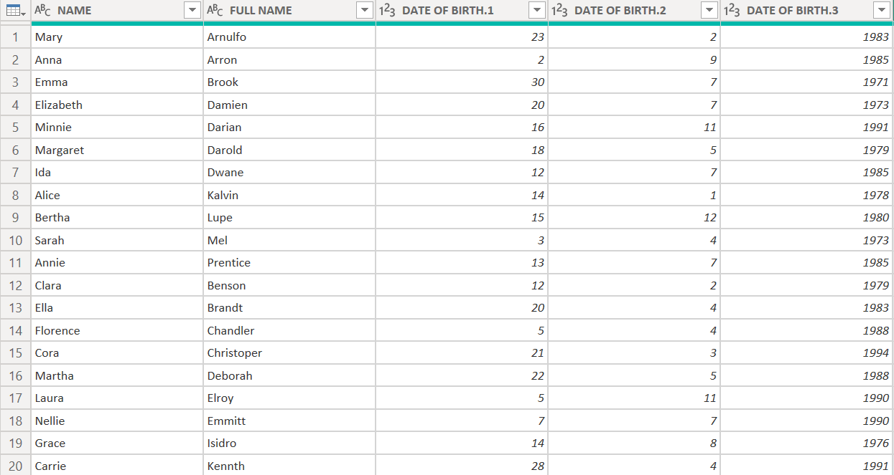
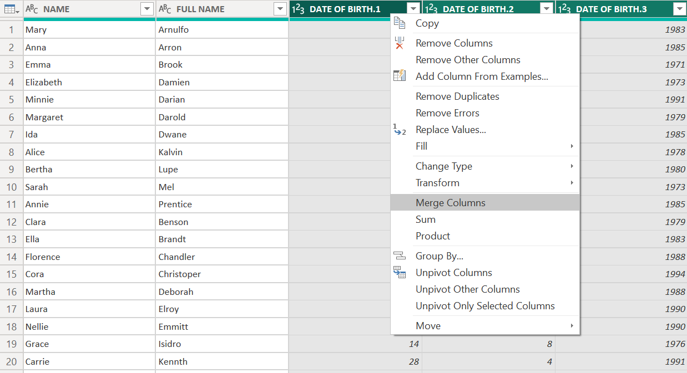
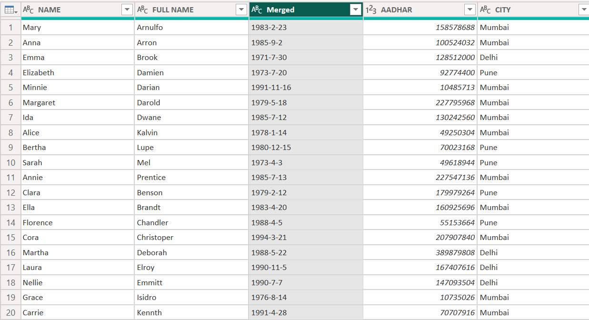
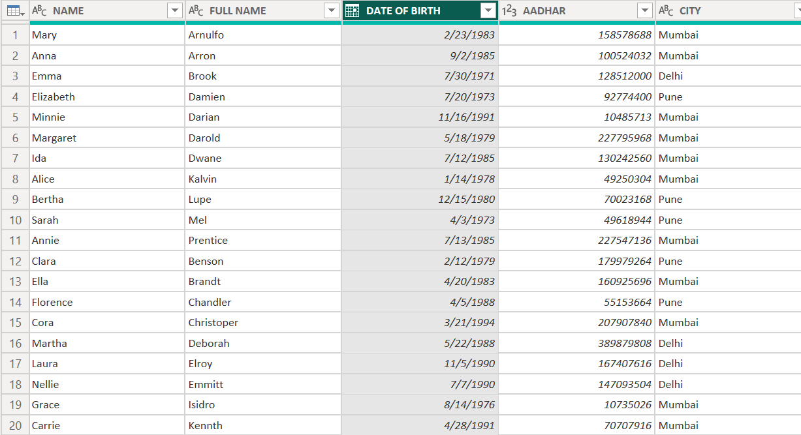
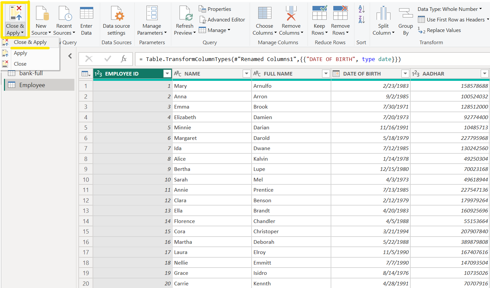
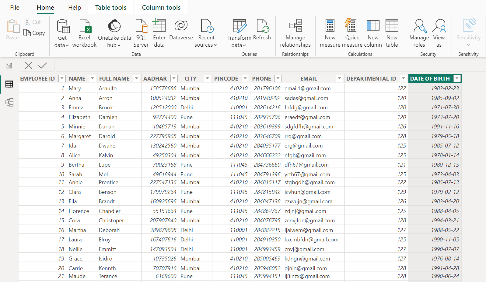

# DATA CLEANING AND TRANSFORMATION

## INTRODUCTION

The task at hand, titled "Data Cleaning and Transformation for 'Employee.csv' Dataset," involves a comprehensive and meticulous cleansing process of the 'Employee.csv' dataset. This dataset, comprising 100 rows of information, is a valuable repository of employee-related data. Data quality is paramount for any analytical or machine learning endeavor, and the effectiveness of subsequent analyses heavily depends on the cleanliness and integrity of the dataset.

In this task, we will employ Power BI as the primary tool for data cleaning. Power BI, a powerful business analytics tool by Microsoft, offers a suite of features and functionalities ideal for data preparation and transformation. Our objective is to leverage Power BI's capabilities to thoroughly clean, sanitize, and optimize the 'Employee.csv' dataset, ensuring that it meets the highest standards of accuracy, consistency, and reliability. By enhancing columns for improved readability and comprehension, standardizing formats, and adjusting data types, we aim to enhance the overall quality of the dataset, thereby laying a robust foundation for any future data-driven analyses or modeling efforts.

## PROBLEM STATEMENT

The task involves a thorough cleaning process for the 'Employee.csv' dataset, encompassing the following steps:
1. Renaming columns and converting column names to uppercase
   
2. Standardizing formats and adjusting data type

The objective is to enhance data consistency, readability, and uniformity within the dataset, ensuring it aligns with best practices for subsequent analyses and modeling.

## SKILLS AND CONCEPTS DEMONSTRATED

In the task of extensively cleaning the 'Employee.csv' dataset, several skills and concepts need to be demonstrated. These include:

1. Data Transformation:
   - Skill in transforming data, including renaming columns, converting text to uppercase, standardizing formats, and adjusting data types
2. Data Quality Assessment:
   - Understanding and assessing data quality issues and implementing solutions to ensure accuracy, completeness, and consistency
3. Tool Proficiency:
   - Demonstrating proficiency in Power BI to perform the necessary data transformations
4. Communication Skills:
   - Clearly documenting the steps taken in the cleaning process, any assumptions made, and the rationale behind the chosen transformations.

By successfully executing these skills and concepts, the task aims to produce a refined and standardized 'Employee.csv' dataset that is ready for further analysis or modeling.

## DATA CLEANING STEPS, DISCUSSIONS AND RESULTS

### 1. Renaming Columns and Converting Column Names to Uppercase:

Data cleaning and transformation within POWER BI is accomplished through the Power Query Editor, a robust tool for shaping, cleaning, and refining data before integrating it into Power BI Desktop. Users have the flexibility to either transform the data in Power Query Editor before loading it or load the dataset into Power BI Desktop and then proceed to Power Query Editor. For this task, we'll begin by importing the employee dataset into Power BI Desktop, following the steps outlined in "Power BI Task 1: Data Integration." [Click Here](https://github.com/Boobae-Vivian/POWER-BI-TASK-1-Dataset-Integration)

Once the employee dataset is imported into Power BI Desktop, it appears in the data pane on the right side of the Power BI environment. To visualize and work on the dataset, click on the table view icon located on the left side of the Power BI environment. Upon inspection, the columns are identified as inconsistent, prompting the need for refinement.

To initiate transformations in the Power Query Editor, click on the transform icon in the Power BI ribbon. This action navigates to the Power Query Editor, where we proceed to change column names by selecting the column header, double-clicking, and entering the desired column names. Additionally, we convert the column names to uppercase to improve visibility. For instance, the 'empID' column becomes 'EMPLOYEE ID,' 'fname' transforms to 'FULL NAME,' 'dob' is updated to 'DATE OF BIRTH,' and so forth.

As the Power Query Editor provides a limited view of the dataset, capturing the entire dataset requires navigating forward and backward, therefore just some aspect of the dataset would be captured to showcase the transformation of changed columns emphasizing the substantial difference between the original and refined columns.

PREVIOUS COLUMNS            | REFINED COLUMNS
:--------------------------:|:-----------------------------:
              |    

### 2. Standardizing Formats and Adjusting Data Type:

   - ### STEP 1 and 2

     Within the Power Query Editor, each column header displays its datatype, allowing users to click on it and modify it to their preferred datatype. In this context, the datatypes for most columns are accurate, with the exception of the "Date of Birth" column, which is incorrectly labeled as ABC datatype instead of the expected date datatype.
Typically, to rectify this, one would click on the ABC datatype near the column header and select "Date" to convert it to the correct date datatype. However, in this case, an error is encountered, indicating an issue with the values in the column.

STEP 1                      | STEP 2
:--------------------------:|:-----------------------------:
              |    

   - ### STEP 3, 4 and 5

     To address the previously encountered issue, click on the date datatype located on the "Date of Birth" column and revert to the previous ABC datatype to navigate away from the error notice back to the column values. Upon further examination, it becomes apparent that the "Date of Birth" column contains inconsistent values, prompting the need for standardization and formatting.

     The inconsistency arises from having two different separators, namely hyphens and slashes, within the values. To establish uniformity, it is essential to use only one separator, either hyphens or slashes. In this scenario, the decision is to replace all slashes with hyphens. To execute this, select the "Date of Birth" column, right-click, choose "Replace Values," and then replace all slashes (/) with hyphens (-). This corrective action ensures consistent formatting with a single separator, as indicated by the yellow highlights in the step 4 snapshot below.

     With this issue resolved, proceed to click on the ABC datatype and select the date datatype to convert the column datatype to date. Despite this effort, an error persists, indicating the presence of another unresolved issue.

STEP 3                      | STEP 4                        
:--------------------------:|:-----------------------------:
              |                          
 
STEP 5
:--------------:
    

 - ### STEP 6, 7 and 8

  To resolve the error encountered after standardizing the "Date of Birth" values, revert to the original ABC datatype by clicking on the date datatype near the column header. This step allows a re-examination of the values to identify any persisting issues. Upon observation, it becomes apparent that the "Date of Birth" values are not in the recognized date format by POWER BI. POWER BI interprets dates as year, month, and day, whereas our date values are in the format of month, day, and year.
  
  To align with POWER BI's date format, the "Date of Birth" column needs to be reformatted. To achieve this, the column is first split into three separate columns—namely, "Date of Birth.1," "Date of Birth.2," and "Date of Birth.3" as shown in step 8 snapshot below. To perform the split, highlight the "Date of Birth" column, right-click, and select "Split Column by Delimiter." A window appears, and POWER BI automatically selects the common separator (delimiter), which, in this case, is the hyphen (previously standardized for consistency). For the "Split at" option, choose "Each occurrence of the delimiter" and click OK.
  
  This action results in the "Date of Birth" column being successfully splitted into three parts, setting the stage for subsequent adjustments to conform to POWER BI's recognized date format.

STEP 6                      | STEP 7                        
:--------------------------:|:-----------------------------:
              |                          
 
STEP 8
:--------------:
   

   - ### STEP 9, 10 and 11

     Continuing the process of aligning the "Date of Birth" values with the recognized date format in Power BI, once the successful split is achieved, the next step involves merging the split columns to adhere to Power BI's recognized date format. To accomplish this, hold the CTRL button and select the "Year" column, the "Month" column, and the "Day" column. Right-click and choose "Merge Columns." A window appears where the delimiter for merging the columns is selected, followed by clicking OK. This action consolidates the split columns into a new column named "Merged," with the datatype identified as ABC.

     To convert this column from ABC to the Date datatype, click on the ABC datatype near the "Merged" column, and select "Date." This modification ensures that the "Date of Birth" column accepts the Date datatype without triggering errors. Subsequently, the Power Query Editor reverses the values of the recognized Power BI date format to day, month, and year as seen in step 11 snapshot below.

STEP 9                     | STEP 10                       
:--------------------------:|:-----------------------------:
            |                          
 
STEP 11                                            
:--------------------------:
  

 - ### STEP 12 and 13

  Upon finishing the process of cleaning and transforming data in the Power Query Editor, select the "Close and Apply" button located on the Power Query Editor ribbon. The cleaned dataset is then returned to the Power BI environment and the "Date of Birth" values, which were reversed during the Power Query Editor process, are reverted to the correct Power BI date format of year, month, and day as seen in step 13 snapshot below.

STEP 12                                            
:--------------------------:
  

STEP 13                                            
:--------------------------:
  

## CONCLUSION

This task of extensively cleaning the 'Employee.csv' dataset has been successfully executed, addressing issues related to column names, formatting, and data types using Power BI's robust Power Query Editor. The dataset now stands as a refined and standardized foundation, ready for analytical and modeling purposes. The meticulous handling of inconsistencies, such as those in the 'Date of Birth' column, demonstrates the effectiveness of the chosen data cleaning strategies.

By utilizing Power BI's functionalities, the dataset has been transformed into a more consistent and reliable form. The successful conversion of data types, standardization of formats, and careful consideration of recognized date structures contribute to a dataset that is not only cleaned but also optimized for subsequent analyses.

This task underscores the importance of data quality in the success of analytical endeavors. The diligence put into cleansing and transforming the dataset is crucial for producing reliable insights and ensuring the dataset's usability in diverse data-driven applications.

UNCLEANED EMPLOYEE DATASET                                       
:--------------------------:
            

CLEANED EMPLOYEE DATASET                                             
:--------------------------:
  

    
   

